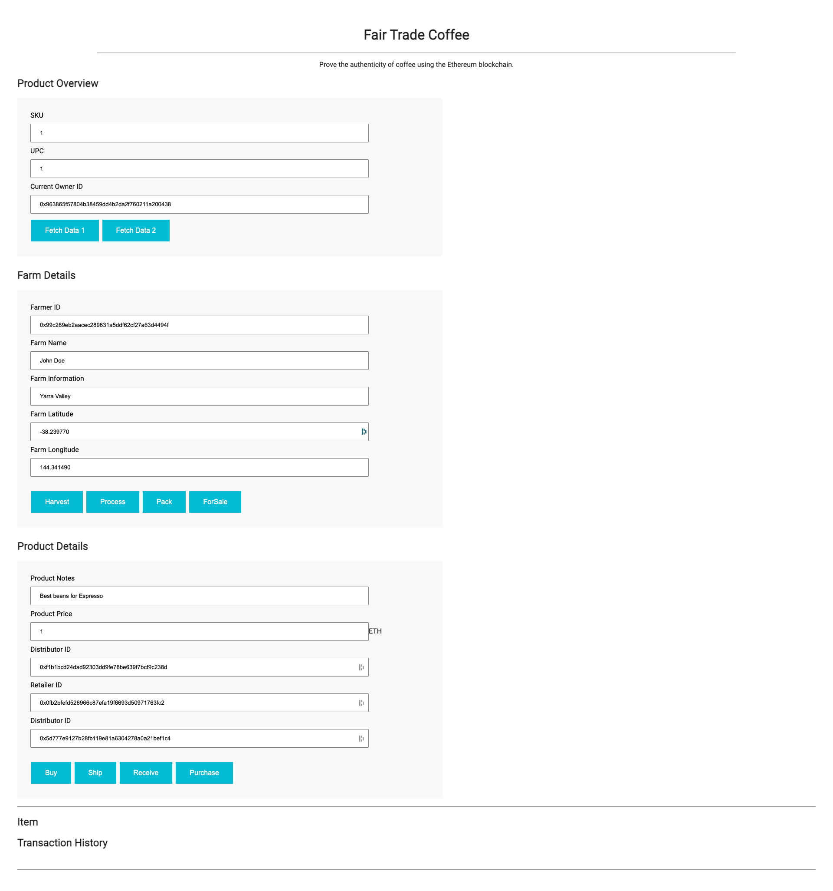

# Espresso
_DApp in Ethereum for a Coffee trade Supply Chain_

## Description
Espresso is a decentralized application _(DApp)_ for the supply chain of coffee backed by the _Ethereum platform_.

The product is tracked and verified by each member of the supply chain.
First by the Farmer, then the Distributor, the Retailer, and the Consumer, each actor with specific functions.



It is published over the Rinkeby network at [0x236ee84FC521d2f665D9c244C54970Efc2a59942](https://rinkeby.etherscan.io/address/0x236ee84FC521d2f665D9c244C54970Efc2a59942)
And the TxID is [0x83e7b91314609d426b7bddd787ab61c98ce73b46c00fb3dbea4542aae4e02199](https://rinkeby.etherscan.io/tx/0x83e7b91314609d426b7bddd787ab61c98ce73b46c00fb3dbea4542aae4e02199)
---

# Local Development
The project is divided into a backend that publishes _smart contracts_ to the _Ethereum network_, and a frontend that allows the interaction with them.

## Technology Stack
- Truffle v5.1.65: As a framework for developing and testing the _smart contracts_. 
- Web3.js v1.2.9: Is the library that connects to the blockchain network and allows the interaction with the contract.
- lite-server 2.4.0: As a node server to exposes the frontend section.
- Node v15.3.0: As a framework over all the libraries are running and the package management system.
- @truffle/hdwallet-provider v1.2.1: this provides the wallet to interact with the Rinkeby network.

## Set Up
### Prerequisites
Please make sure you've already installed ganache-cli, Truffle and enabled MetaMask extension in your browser.

Truffle is a development environment tha manage the contract artifacts.
The right version is included in the `package.json` so you only need to download the dependencies

```shell
# install all dependencies
$ npm install
```

To sync a MetaMask wallet you should create a `.secret` file and add the mnemonic as plain text

```shell
# create the file that will contain the MetaMask mnemonic
touch .secret
```

## Build
### Backend
To generate the contracts artifacts and deploy them to a local blockchain network using truffle, run:
```shell
# start a local network and run the truffle console
$ truffle console
# or if you don't have ganache running
$ truffle develop
# creates the bytecode and the ABI
> compile
# deploys the contracts to the local network
> migrate --reset
```

### Frontend
In a separate terminal window, launch the DApp:
```shell
# runs lite-server 
$ npm run dev
```

and visit http://localhost/3000

## Run Tests
The test should be run after the contract is migrated
```shell
$ truffle test
```

---
# Deployment

## Publish
Publishing the _smart contract_ into a public network requires a wallet with Ether, and an Infura account.
Store the mnemonic of the wallet with founds in the `.secret` file

```shell
# publish into rinkeby test network
truffle migrate --reset --network rinkeby
```

---

# User Guide
## Documentation
Documentation for the client
- [Software Architecture Document](SAD.md)

---

# Authors
- [:email: Gerardo Cortés](mailto:gerardo.cortes.o@gmail.com)
