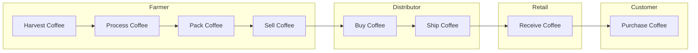
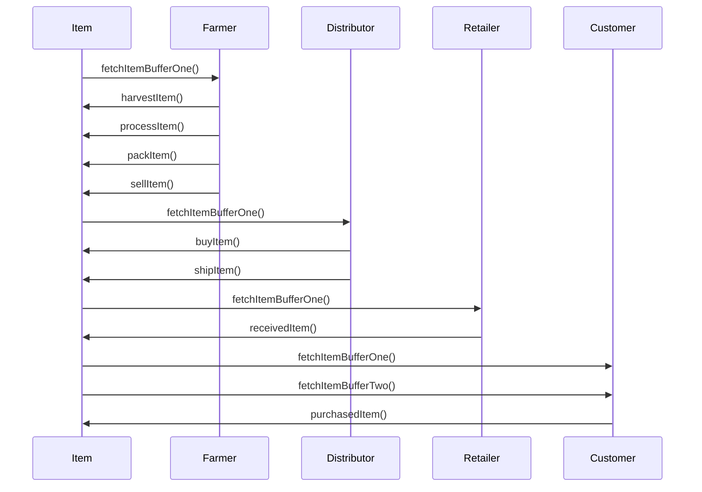
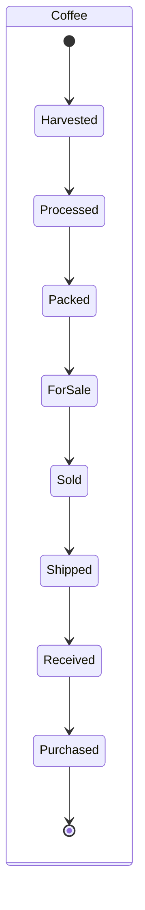
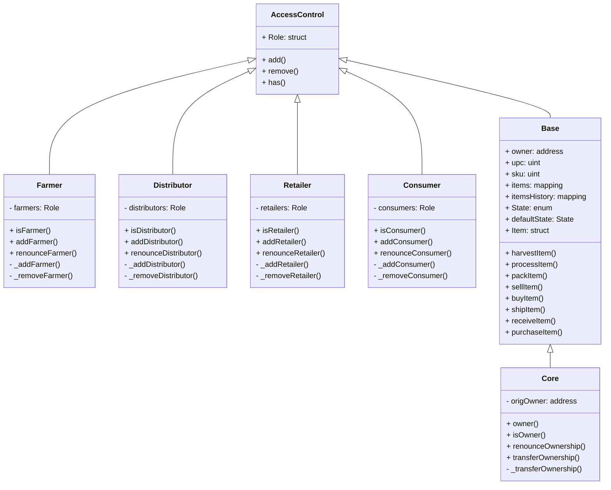

# Software Architecture Document

## Activity Diagram - Swinlane

[](https://mermaid-js.github.io/mermaid-live-editor/#/edit/eyJjb2RlIjoiZ3JhcGggTFJcbiAgICBzdWJncmFwaCBGYXJtZXJcbiAgICAxW0hhcnZlc3QgQ29mZmVlXS0tPjJbUHJvY2VzcyBDb2ZmZWVdLS0-M1tQYWNrIENvZmZlZV0tLT40W1NlbGwgQ29mZmVlXVxuICAgIGVuZFxuXG4gICAgc3ViZ3JhcGggRGlzdHJpYnV0b3JcbiAgICA0W1NlbGwgQ29mZmVlXS0tPjVbQnV5IENvZmZlZV0tLT42W1NoaXAgQ29mZmVlXVxuICAgIGVuZFxuXG4gICAgc3ViZ3JhcGggUmV0YWlsXG4gICAgNltTaGlwIENvZmZlZV0tLT43W1JlY2VpdmUgQ29mZmVlXVxuICAgIGVuZFxuXG4gICAgc3ViZ3JhcGggQ3VzdG9tZXJcbiAgICA3W1JlY2VpdmUgQ29mZmVlXS0tPjhbUHVyY2hhc2UgQ29mZmVlXVxuICAgIGVuZCIsIm1lcm1haWQiOnsidGhlbWUiOiJuZXV0cmFsIn0sInVwZGF0ZUVkaXRvciI6ZmFsc2V9)

## Sequence Diagram

[](https://mermaid-js.github.io/mermaid-live-editor/#/edit/eyJjb2RlIjoic2VxdWVuY2VEaWFncmFtXG4gICAgSXRlbS0-PkZhcm1lcjogZmV0Y2hJdGVtQnVmZmVyT25lKClcbiAgICBGYXJtZXItPj5JdGVtOiBoYXJ2ZXN0SXRlbSgpXG4gICAgRmFybWVyLT4-SXRlbTogcHJvY2Vzc0l0ZW0oKVxuICAgIEZhcm1lci0-Pkl0ZW06IHBhY2tJdGVtKClcbiAgICBGYXJtZXItPj5JdGVtOiBzZWxsSXRlbSgpXG5cbiAgICBJdGVtLT4-RGlzdHJpYnV0b3I6IGZldGNoSXRlbUJ1ZmZlck9uZSgpXG4gICAgRGlzdHJpYnV0b3ItPj5JdGVtOiBidXlJdGVtKClcbiAgICBEaXN0cmlidXRvci0-Pkl0ZW06IHNoaXBJdGVtKClcblxuICAgIEl0ZW0tPj5SZXRhaWxlcjogZmV0Y2hJdGVtQnVmZmVyT25lKClcbiAgICBSZXRhaWxlci0-Pkl0ZW06IHJlY2VpdmVkSXRlbSgpXG5cbiAgICBJdGVtLT4-Q3VzdG9tZXI6IGZldGNoSXRlbUJ1ZmZlck9uZSgpXG4gICAgSXRlbS0-PkN1c3RvbWVyOiBmZXRjaEl0ZW1CdWZmZXJUd28oKVxuICAgIEN1c3RvbWVyLT4-SXRlbTogcHVyY2hhc2VkSXRlbSgpIiwibWVybWFpZCI6eyJ0aGVtZSI6Im5ldXRyYWwifSwidXBkYXRlRWRpdG9yIjpmYWxzZX0)

## State Diagram

[](https://mermaid-js.github.io/mermaid-live-editor/#/edit/eyJjb2RlIjoic3RhdGVEaWFncmFtLXYyXG4gICAgc3RhdGUgQ29mZmVlIHtcbiAgICAgICAgWypdIC0tPiBIYXJ2ZXN0ZWRcbiAgICAgICAgSGFydmVzdGVkIC0tPiBQcm9jZXNzZWRcbiAgICAgICAgUHJvY2Vzc2VkIC0tPiBQYWNrZWRcbiAgICAgICAgUGFja2VkIC0tPiBGb3JTYWxlXG4gICAgICAgIEZvclNhbGUgLS0-IFNvbGRcbiAgICAgICAgU29sZCAtLT4gU2hpcHBlZFxuICAgICAgICBTaGlwcGVkIC0tPiBSZWNlaXZlZFxuICAgICAgICBSZWNlaXZlZCAtLT4gUHVyY2hhc2VkXG4gICAgICAgIFB1cmNoYXNlZCAtLT4gWypdXG4gICAgfSIsIm1lcm1haWQiOnsidGhlbWUiOiJuZXV0cmFsIn0sInVwZGF0ZUVkaXRvciI6ZmFsc2V9)

## Data Diagram
Access Control Contract: defines each actor role

Base Contract: Defines Structs, functions, etc
SupplyChain

Core Contract: Main contract that tract pet adoption
Ownable: Provides basic authorization control

[![](https://mermaid.ink/img/eyJjb2RlIjoiY2xhc3NEaWFncmFtXG4gICAgQWNjZXNzQ29udHJvbCA8fC0tIEZhcm1lclxuICAgIEFjY2Vzc0NvbnRyb2wgPHwtLSBEaXN0cmlidXRvclxuICAgIEFjY2Vzc0NvbnRyb2wgPHwtLSBSZXRhaWxlclxuICAgIEFjY2Vzc0NvbnRyb2wgPHwtLSBDb25zdW1lclxuICAgIEFjY2Vzc0NvbnRyb2wgPHwtLSBCYXNlXG4gICAgQmFzZSA8fC0tIENvcmVcblxuICAgIGNsYXNzIEFjY2Vzc0NvbnRyb2wge1xuICAgICAgICArIFJvbGU6IHN0cnVjdFxuICAgICAgICArIGFkZCgpXG4gICAgICAgICsgcmVtb3ZlKClcbiAgICAgICAgKyBoYXMoKVxuICAgIH1cblxuICAgIGNsYXNzIEZhcm1lciB7XG4gICAgICAgIC0gZmFybWVyczogUm9sZVxuICAgICAgICArIGlzRmFybWVyKClcbiAgICAgICAgKyBhZGRGYXJtZXIoKVxuICAgICAgICArIHJlbm91bmNlRmFybWVyKClcbiAgICAgICAgLSBfYWRkRmFybWVyKClcbiAgICAgICAgLSBfcmVtb3ZlRmFybWVyKClcbiAgICB9XG5cbiAgICBjbGFzcyBEaXN0cmlidXRvciB7XG4gICAgICAgIC0gZGlzdHJpYnV0b3JzOiBSb2xlXG4gICAgICAgICsgaXNEaXN0cmlidXRvcigpXG4gICAgICAgICsgYWRkRGlzdHJpYnV0b3IoKVxuICAgICAgICArIHJlbm91bmNlRGlzdHJpYnV0b3IoKVxuICAgICAgICAtIF9hZGREaXN0cmlidXRvcigpXG4gICAgICAgIC0gX3JlbW92ZURpc3RyaWJ1dG9yKClcbiAgICB9XG5cbiAgICBjbGFzcyBSZXRhaWxlciB7XG4gICAgICAgIC0gcmV0YWlsZXJzOiBSb2xlXG4gICAgICAgICsgaXNSZXRhaWxlcigpXG4gICAgICAgICsgYWRkUmV0YWlsZXIoKVxuICAgICAgICArIHJlbm91bmNlUmV0YWlsZXIoKVxuICAgICAgICAtIF9hZGRSZXRhaWxlcigpXG4gICAgICAgIC0gX3JlbW92ZVJldGFpbGVyKClcbiAgICB9XG5cbiAgICBjbGFzcyBDb25zdW1lciB7XG4gICAgICAgIC0gY29uc3VtZXJzOiBSb2xlXG4gICAgICAgICsgaXNDb25zdW1lcigpXG4gICAgICAgICsgYWRkQ29uc3VtZXIoKVxuICAgICAgICArIHJlbm91bmNlQ29uc3VtZXIoKVxuICAgICAgICAtIF9hZGRDb25zdW1lcigpXG4gICAgICAgIC0gX3JlbW92ZUNvbnN1bWVyKClcbiAgICB9XG5cbiAgICBjbGFzcyBCYXNlIHtcbiAgICAgICAgKyBvd25lcjogYWRkcmVzc1xuICAgICAgICArIHVwYzogdWludFxuICAgICAgICArIHNrdTogdWludFxuICAgICAgICArIGl0ZW1zOiBtYXBwaW5nXG4gICAgICAgICsgaXRlbXNIaXN0b3J5OiBtYXBwaW5nXG4gICAgICAgICsgU3RhdGU6IGVudW1cbiAgICAgICAgKyBkZWZhdWx0U3RhdGU6IFN0YXRlXG4gICAgICAgICsgSXRlbTogc3RydWN0XG4gICAgICAgICsgaGFydmVzdEl0ZW0oKVxuICAgICAgICArIHByb2Nlc3NJdGVtKClcbiAgICAgICAgKyBwYWNrSXRlbSgpXG4gICAgICAgICsgc2VsbEl0ZW0oKVxuICAgICAgICArIGJ1eUl0ZW0oKVxuICAgICAgICArIHNoaXBJdGVtKClcbiAgICAgICAgKyByZWNlaXZlSXRlbSgpXG4gICAgICAgICsgcHVyY2hhc2VJdGVtKClcbiAgICB9XG5cbiAgICBjbGFzcyBDb3JlIHtcbiAgICAgICAgLSBvcmlnT3duZXI6IGFkZHJlc3NcbiAgICAgICAgKyBvd25lcigpXG4gICAgICAgICsgaXNPd25lcigpXG4gICAgICAgICsgcmVub3VuY2VPd25lcnNoaXAoKVxuICAgICAgICArIHRyYW5zZmVyT3duZXJzaGlwKClcbiAgICAgICAgLSBfdHJhbnNmZXJPd25lcnNoaXAoKVxuICAgIH1cbiAgICAgICAgICAgIiwibWVybWFpZCI6eyJ0aGVtZSI6Im5ldXRyYWwifSwidXBkYXRlRWRpdG9yIjpmYWxzZX0)](https://mermaid-js.github.io/mermaid-live-editor/#/edit/eyJjb2RlIjoiY2xhc3NEaWFncmFtXG4gICAgQWNjZXNzQ29udHJvbCA8fC0tIEZhcm1lclxuICAgIEFjY2Vzc0NvbnRyb2wgPHwtLSBEaXN0cmlidXRvclxuICAgIEFjY2Vzc0NvbnRyb2wgPHwtLSBSZXRhaWxlclxuICAgIEFjY2Vzc0NvbnRyb2wgPHwtLSBDb25zdW1lclxuICAgIEFjY2Vzc0NvbnRyb2wgPHwtLSBCYXNlXG4gICAgQmFzZSA8fC0tIENvcmVcblxuICAgIGNsYXNzIEFjY2Vzc0NvbnRyb2wge1xuICAgICAgICArIFJvbGU6IHN0cnVjdFxuICAgICAgICArIGFkZCgpXG4gICAgICAgICsgcmVtb3ZlKClcbiAgICAgICAgKyBoYXMoKVxuICAgIH1cblxuICAgIGNsYXNzIEZhcm1lciB7XG4gICAgICAgIC0gZmFybWVyczogUm9sZVxuICAgICAgICArIGlzRmFybWVyKClcbiAgICAgICAgKyBhZGRGYXJtZXIoKVxuICAgICAgICArIHJlbm91bmNlRmFybWVyKClcbiAgICAgICAgLSBfYWRkRmFybWVyKClcbiAgICAgICAgLSBfcmVtb3ZlRmFybWVyKClcbiAgICB9XG5cbiAgICBjbGFzcyBEaXN0cmlidXRvciB7XG4gICAgICAgIC0gZGlzdHJpYnV0b3JzOiBSb2xlXG4gICAgICAgICsgaXNEaXN0cmlidXRvcigpXG4gICAgICAgICsgYWRkRGlzdHJpYnV0b3IoKVxuICAgICAgICArIHJlbm91bmNlRGlzdHJpYnV0b3IoKVxuICAgICAgICAtIF9hZGREaXN0cmlidXRvcigpXG4gICAgICAgIC0gX3JlbW92ZURpc3RyaWJ1dG9yKClcbiAgICB9XG5cbiAgICBjbGFzcyBSZXRhaWxlciB7XG4gICAgICAgIC0gcmV0YWlsZXJzOiBSb2xlXG4gICAgICAgICsgaXNSZXRhaWxlcigpXG4gICAgICAgICsgYWRkUmV0YWlsZXIoKVxuICAgICAgICArIHJlbm91bmNlUmV0YWlsZXIoKVxuICAgICAgICAtIF9hZGRSZXRhaWxlcigpXG4gICAgICAgIC0gX3JlbW92ZVJldGFpbGVyKClcbiAgICB9XG5cbiAgICBjbGFzcyBDb25zdW1lciB7XG4gICAgICAgIC0gY29uc3VtZXJzOiBSb2xlXG4gICAgICAgICsgaXNDb25zdW1lcigpXG4gICAgICAgICsgYWRkQ29uc3VtZXIoKVxuICAgICAgICArIHJlbm91bmNlQ29uc3VtZXIoKVxuICAgICAgICAtIF9hZGRDb25zdW1lcigpXG4gICAgICAgIC0gX3JlbW92ZUNvbnN1bWVyKClcbiAgICB9XG5cbiAgICBjbGFzcyBCYXNlIHtcbiAgICAgICAgKyBvd25lcjogYWRkcmVzc1xuICAgICAgICArIHVwYzogdWludFxuICAgICAgICArIHNrdTogdWludFxuICAgICAgICArIGl0ZW1zOiBtYXBwaW5nXG4gICAgICAgICsgaXRlbXNIaXN0b3J5OiBtYXBwaW5nXG4gICAgICAgICsgU3RhdGU6IGVudW1cbiAgICAgICAgKyBkZWZhdWx0U3RhdGU6IFN0YXRlXG4gICAgICAgICsgSXRlbTogc3RydWN0XG4gICAgICAgICsgaGFydmVzdEl0ZW0oKVxuICAgICAgICArIHByb2Nlc3NJdGVtKClcbiAgICAgICAgKyBwYWNrSXRlbSgpXG4gICAgICAgICsgc2VsbEl0ZW0oKVxuICAgICAgICArIGJ1eUl0ZW0oKVxuICAgICAgICArIHNoaXBJdGVtKClcbiAgICAgICAgKyByZWNlaXZlSXRlbSgpXG4gICAgICAgICsgcHVyY2hhc2VJdGVtKClcbiAgICB9XG5cbiAgICBjbGFzcyBDb3JlIHtcbiAgICAgICAgLSBvcmlnT3duZXI6IGFkZHJlc3NcbiAgICAgICAgKyBvd25lcigpXG4gICAgICAgICsgaXNPd25lcigpXG4gICAgICAgICsgcmVub3VuY2VPd25lcnNoaXAoKVxuICAgICAgICArIHRyYW5zZmVyT3duZXJzaGlwKClcbiAgICAgICAgLSBfdHJhbnNmZXJPd25lcnNoaXAoKVxuICAgIH1cbiAgICAgICAgICAgIiwibWVybWFpZCI6eyJ0aGVtZSI6Im5ldXRyYWwifSwidXBkYXRlRWRpdG9yIjpmYWxzZX0)

